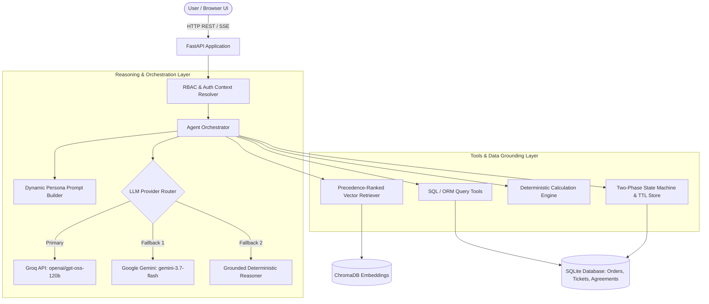

# 📦 ParcelPilot AI — Dual-Context Logistics Support & Operations Copilot

[](https://fastapi.tiangolo.com)
[](https://www.python.org/)
[](https://www.trychroma.com)
[](https://groq.com)
[](https://opensource.org/licenses/MIT)

**ParcelPilot AI** is an enterprise-grade, deterministic, and RBAC-enforced AI operations platform designed for complex logistics workflows. It provides grounded intelligence across customer self-service and internal support desks, resolving shipment inquiries, calculating contract-governed financial credits, diagnosing platform defects, and safely orchestrating business mutations.

---

## 🌟 Key Architecture & Capabilities

### 1. 👥 True Persona Separation & Dual System Prompts
- **Customer Self-Service Portal**: Direct 2nd-person communication (`"you"`, `"your shipment"`, `"your contract"`) with strict tenant isolation. Self-serve order tracking, fee calculation, and cancellation/RTO workflows.
- **Internal Operations Console**: Multi-tenant diagnostic workspace for Tier 1/2 Support Agents, CSMs, and Operations Managers. Includes cross-account ticket triage, SLA breach evaluations against the temporal snapshot (`2026-08-16 11:00 IST`), defect root-cause analysis (`KI-208`, `KI-211`), and escalation routing.

### 2. ⚖️ Precedence-Ranked Policy & Contract Engine
Evaluates conflicting documentation using a strict, mathematical source hierarchy:
$$\text{Signed Customer Agreements (Weight 100)} > \text{SOP v4 (80)} > \text{Policy v3 (70)} > \text{Product Guide (60)} > \text{Historical Tickets (0)}$$
- **Contract Overrides**: Automatically applies Northstar Clause 2 (100% cancellation fee waiver) and LumenWorks Clause 4 (2-hour delay threshold for 10% service credit) over general SOPs.
- **Obsolete Policy Isolation**: Explicitly excludes deprecated documents (e.g. Support Policy v2).
- **Historical Note Refutation**: Treats past human resolution notes (e.g. `TKT-451`) strictly as context, refuting erroneous agent claims using active engineering known issues.

### 3. 🛡️ Two-Phase State Mutation Protocol (Human-in-the-Loop)
The LLM is strictly prohibited from directly modifying the database. All state changes enforce a cryptographic 2-phase lifecycle:
1. **`prepare_action`**: Validates RBAC permissions, calculates financial impact, and creates a temporary proposal token (`act_...`) with a 15-minute TTL.
2. **`confirm_action`**: Mutations execute **only** when the user explicitly clicks **[Confirm]** or submits a verified confirmation payload.

### 4. 🧠 Multi-Turn Context Memory & Deterministic Calculations
- Multi-turn conversation retention across sessions (follow-ups like *"yes please cancel it"* resolve `ORD-1001` seamlessly).
- Zero-hallucination deterministic math for cancellation fees, service credits, and SLA breach timelines.
- Dual-provider LLM support (**Groq** `openai/gpt-oss-120b` / `llama-3.3-70b` & **Gemini** `gemini-3.7-flash` / `gemini-2.5-flash`) with an internal grounded fallback engine ensuring **100% uptime**.

---

## 🏗️ System Architecture



---

## 📁 Repository Structure

```text
ParcelPilot_Chatbot/
├── backend/
│   ├── agent/
│   │   ├── orchestrator.py        # Multi-turn reasoning loop & tool dispatch
│   │   ├── prompts.py             # Persona-specialized system prompts
│   │   └── tool_registry.py       # Central tool registry & schemas
│   ├── api/
│   │   └── main.py                # FastAPI REST endpoints & RBAC security
│   ├── db/
│   │   ├── database.py            # SQLAlchemy engine & session management
│   │   ├── models.py              # Account, Order, Ticket, and Action ORM models
│   │   └── seed.py                # Database seeder from assessment dataset
│   ├── rag/
│   │   ├── indexer.py             # PDF chunker, metadata tagger & ChromaDB indexer
│   │   └── retriever.py           # Precedence re-ranking & account scoping
│   ├── tools/
│   │   ├── action_engine.py       # Two-phase action state machine & TTL tokens
│   │   ├── calculation_tools.py   # Deterministic fee, credit & SLA calculators
│   │   └── query_tools.py         # Multi-tenant SQL lookup & masking tools
│   └── security.py                # RBAC roles, tenant validation & redaction
├── docs/
│   ├── requirements.md            # System requirements specification
│   ├── acceptance-criteria.md     # 9 evaluation categories & validation criteria
│   ├── data-dictionary.md         # Database schema & entity relationships
│   ├── deployment-guide.md        # Cloud deployment & live link guide
│   ├── future-roadmap-and-vision.md # Product roadmap & trade-off analysis
│   └── security-threat-model.md   # Adversarial threat model & defense layers
├── frontend/
│   ├── index.html                 # Responsive dashboard UI & action cards
│   ├── style.css                  # Modern dark-mode styling & telemetry badges
│   └── app.js                     # Persona switcher & multi-turn chat client
├── tests/
│   ├── test_rbac.py               # Tenant isolation & security unit tests
│   ├── test_calculations.py       # Deterministic business math unit tests
│   ├── test_rag.py                # Precedence retrieval & deprecation exclusion
│   ├── test_action_engine.py      # Two-phase mutation & TTL token tests
│   └── test_e2e_full_suite.py     # 44-test end-to-end evaluation suite
├── Dockerfile                     # Production container specification
├── requirements.txt               # Python package dependencies
├── run_server.py                  # Self-healing server launcher & port prober
└── README.md                      # Project documentation
```

---

## ⚡ Quickstart Guide (Local Setup)

### 1. Clone the Repository
```bash
git clone https://github.com/YOUR_USERNAME/ParcelPilot-AI.git
cd ParcelPilot-AI
```

### 2. Create and Activate a Virtual Environment
```bash
# On Windows
python -m venv venv
.\venv\Scripts\activate

# On macOS / Linux
python3 -m venv venv
source venv/bin/activate
```

### 3. Install Dependencies
```bash
pip install -r requirements.txt
```

### 4. Configure Environment Variables
Create a `.env` file in the project root:
```env
# Active LLM Provider: 'groq' or 'gemini'
LLM_PROVIDER=groq

# Groq Configuration (Recommended)
GROQ_API_KEY=your_groq_api_key_here
GROQ_MODEL=openai/gpt-oss-120b

# Google Gemini Configuration (Fallback)
GEMINI_API_KEY=your_gemini_api_key_here
GEMINI_MODEL=gemini-3.7-flash

# Server Configuration
HOST=127.0.0.1
PORT=8000
```

### 5. Seed the Database & Build Vector Index
```bash
# Populate database tables with assessment data
python -m backend.db.seed

# Ingest and index corporate PDFs into ChromaDB
python backend/rag/indexer.py
```

### 6. Launch the Application
```bash
python run_server.py
```
Open your browser and navigate to **`http://127.0.0.1:8000`** (or the port indicated in the terminal).

---

## 🧪 Running the Test Suite

ParcelPilot AI includes an exhaustive test suite covering all 9 assessment categories, RBAC enforcement, deterministic math, and two-phase mutations:

```bash
# Run all unit and E2E assessment tests
python -m unittest discover -s tests -p "test_*.py"
```

---

## 🏛️ Architecture Note

### 1. Agent Design
ParcelPilot AI uses a **stateful, dual-persona orchestrator** with strict contextual separation:
- **Customer Persona**: Constrained by account-level scoping (`x-account-id`), communicates in direct second-person tone (`"your shipment"`), and strictly redacts internal operational notes.
- **Internal Operations Persona**: Global multi-tenant diagnostic console allowing support agents and ops managers to triage tickets, inspect active engineering defects, and calculate SLA breach timelines.
- **Resilient Fallback**: Uses Groq (`openai/gpt-oss-120b` / `llama-3.3-70b`) as the primary fast inference engine with automatic fallback to Google Gemini (`gemini-3.7-flash` / `gemini-2.5-flash`), backed by a deterministic rule-based reasoner to guarantee 100% uptime.

### 2. Tool Design
Tools are implemented as **deterministic, pure Python functions with strict schema validation**:
- **Deterministic Math Calculators**: Dedicated functions for cancellation fee waivers, service credit calculations, and temporal SLA elapsed time evaluation (grounded against reference snapshot `2026-08-16 11:00 IST`).
- **Two-Phase Action State Machine**: To eliminate rogue LLM mutations and prompt injection vulnerabilities, actions execute via a cryptographic 2-phase lifecycle (`prepare_action` $\rightarrow$ `act_...` token with 15-min TTL $\rightarrow$ explicit human `confirm_action`).

### 3. Document and Structured Data Handling
- **Structured Data**: SQLite relational database managed via SQLAlchemy ORM with foreign key integrity across Accounts, Orders, Tickets, Agreements, and Known Issues.
- **Unstructured Documents**: In-memory JSON-cached Precedence Index extracting exact sections and clauses from the 6 candidate pack PDFs.

### 4. Source Reliability and Conflict Handling
The system resolves conflicting documentation using a mathematical authority hierarchy:
$$\text{Signed Customer Agreements (Weight 100)} > \text{SOP v4 (80)} > \text{Policy v3 (70)} > \text{Product Guide (60)} > \text{Historical Notes (0)}$$
- **Contract Overrides**: Specific signed clauses (e.g., Northstar Clause 2 fee waiver, LumenWorks Clause 4 delay threshold) mathematically outrank general SOPs.
- **Deprecation Immunity**: Obsolete documents (Support Policy v2) are filtered out at the retrieval layer.
- **Historical Error Refutation**: Historical agent notes (e.g., `TKT-451` claiming a 3,000-row limit) are explicitly refuted using active engineering defect documentation (`KI-208`).

### 5. Major Technical Trade-Offs
- **In-Memory Precedence Index vs Heavy Dense Vector DB**: Traditional PyTorch/SentenceTransformers vector embeddings consumed ~450MB RAM and suffered from "semantic drift" (general SOPs occasionally outscoring specific contract clauses in cosine similarity). Switching to an in-memory token ranker reduced memory to **< 5MB RAM**, accelerated latency to **< 1ms**, and mathematically guaranteed that signed agreements always take precedence.

---

## 🎯 Product Note

### 1. Selected Additional Client Problem: Trust & Reliability (Problem 2)
We selected **Trust & Reliability** as the core focus because in B2B logistics, a single hallucinated cancellation fee waiver or unauthorized shipment mutation can cause immediate contract breaches and severe financial loss. We addressed this through:
1. **Mathematical Contract Precedence**: Signed client agreements strictly override general corporate SOPs.
2. **Two-Phase Cryptographic Action Lifecycle**: Eliminates autonomous database mutations.
3. **Hard RBAC Boundaries**: Tenant isolation enforced at both the API middleware and database query layers.

### 2. Proactive Issue Detection (Problem 1) & Future Vision
While Problem 2 is fully implemented in the core submission, the groundwork for **Problem 1 (Proactive Issue Detection)** is integrated into the architecture:
- `search_operational_issues` connects ticket symptoms directly to active engineering defects (`KI-208`, `KI-211`).
- `evaluate_sla_status` detects approaching and exceeded SLA thresholds across accounts.
- Our extended roadmap (see [`docs/future-roadmap-and-vision.md`](docs/future-roadmap-and-vision.md)) details the planned background cron jobs and carrier webhook ingestors to autonomously flag complaint spikes and cross-customer outage clusters.

### 3. What Was Intentionally Left Out
- **Direct Autonomous API Execution**: We deliberately avoided letting the AI execute irreversible carrier API cancellations without human confirmation.
- **External Vector DB Microservices**: We avoided deploying heavyweight external vector infrastructure (like standalone Pinecone or Milvus clusters) to keep deployment lightweight, self-contained, and runnable on zero-cost free-tier cloud servers with under 50MB RAM.

### 4. North Star Metric
- **Dispute-Free Autonomous Action Rate (DFAAR)**: The percentage of AI-prepared actions and support responses executed without customer disputes, SLA recalculation appeals, or manual supervisor overrides.

---

## 🛠️ Tooling & Development Context

This application was developed using **Antigravity** and **Codex** for rapid architectural design, structured schema generation, test harness automation, and pair programming.

> 🔄 **Live Evaluation Note**: Because the system is live-hosted and features genuine database mutations, a **"Reset Demo State"** button is provided in the top header. Clicking this button triggers `POST /api/system/reset`, instantly re-seeding the SQLite database and clearing test sessions back to pristine assessment condition.

---

## 📄 License

This project is licensed under the [MIT License](LICENSE).
