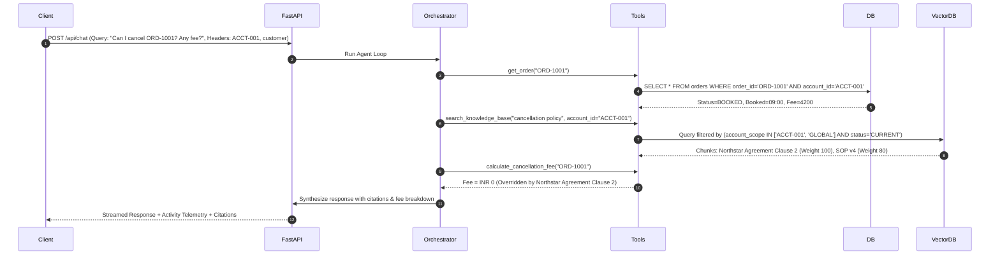
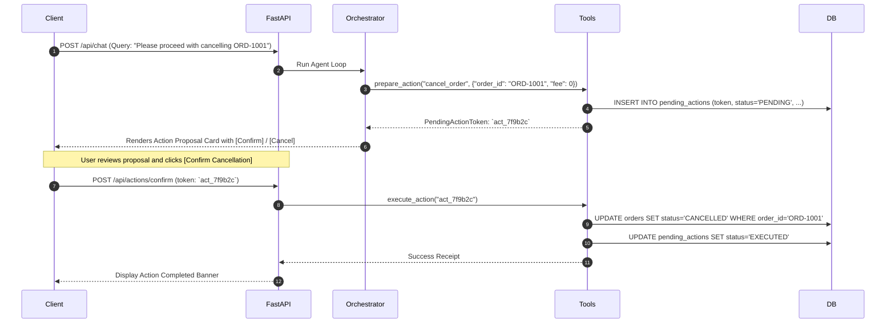

# ParcelPilot AI — End-to-End System Architecture (Agent 03)

## 1. System Architecture Overview

ParcelPilot AI is architected as a modular, production-ready AI service comprising a modern responsive Frontend, a FastAPI Backend with an Agentic Orchestrator, an isolated Tool & Calculation Layer, a deterministic Relational Database, a Metadata-Enriched Vector Knowledge Base (RAG), and a strict Two-Phase Action Confirmation State Machine.

```mermaid
flowchart TB
    subgraph Client Layer [Frontend Interface (Vanilla Web / Modern UI)]
        UI[Chat Console & Activity Stream]
        PersonaSwitch[Persona / Mode Switcher]
        ActionCard[Action Proposal & Confirmation Cards]
    end

    subgraph Security Layer [Authentication & RBAC Enforcement]
        AuthMW[Session Context & RBAC Middleware]
        TenantGuard[Tenant Isolation Guard]
    end

    subgraph Backend Core [FastAPI Core Engine]
        APIRouter[REST & SSE Endpoints]
        Orchestrator[Agent Orchestrator (Gemini 2.5 / 3.7 / Tool Loop)]
        PromptEngine[Prompt & Policy Grounding Engine]
    end

    subgraph Tool Layer [Deterministic Business Tools]
        ToolRegistry[RBAC-Filtered Tool Registry]
        QueryTools[Structured Query Tools (Order, Ticket, Account)]
        CalcTools[Calculation Tools (Fee, Credit, SLA)]
        OpsTools[Ops Intelligence & Known Issue Tools]
        ActionEngine[2-Phase Action State Machine]
    end

    subgraph Storage Layer [Persistence & Knowledge Stores]
        DB[(SQLite / SQLAlchemy Relational DB)]
        VectorDB[(ChromaDB Vector Store - Chunk & Metadata)]
        DocIngest[PDF Ingestion & Metadata Pipeline]
    end

    UI -->|HTTP / SSE| AuthMW
    PersonaSwitch -->|Header Context| AuthMW
    AuthMW --> TenantGuard
    TenantGuard --> APIRouter
    APIRouter --> Orchestrator
    Orchestrator --> PromptEngine
    Orchestrator --> ToolRegistry
    ToolRegistry --> QueryTools
    ToolRegistry --> CalcTools
    ToolRegistry --> OpsTools
    ToolRegistry --> ActionEngine
    QueryTools --> DB
    CalcTools --> DB
    OpsTools --> DB
    ActionEngine --> DB
    ActionCard -->|Confirm Token| ActionEngine
    DocIngest --> VectorDB
    ToolRegistry -->|Semantic Search| VectorDB
```

---

## 2. Component Breakdown & Responsibilities

### 2.1 Frontend Client (Agent 07)
- **Technology**: Modern Responsive Web UI (Vanilla CSS + HTML5 + ES6 JavaScript).
- **Key Features**:
  - **Persona Selector**: Instant switching between Customer Accounts (`ACCT-001` Northstar, `ACCT-002` LumenWorks, `ACCT-003` Beacon Retail, `ACCT-004` Axis Labs) and Internal Personas (Support Agent Maya/Rohit, Ops Manager Priya).
  - **Live Agent Activity Stream**: Displays active tool executions (e.g. `Querying Order ORD-1001`, `Searching Knowledge Base for Northstar Agreement Clause 2`, `Calculating SLA Status`).
  - **Interactive Action Cards**: Visual cards displaying pending action summary, calculated fees/credits, policy citations, and explicit **[Confirm Action]** / **[Cancel]** buttons.
  - **Source Citation Drawer**: Clickable evidence cards displaying document name, clause, authority rank, and exact snippet text.

### 2.2 API & RBAC Middleware (Agent 04 & Agent 08)
- **Technology**: FastAPI with Pydantic v2 schemas and Dependency Injection.
- **Endpoints**:
  - `POST /api/chat`: Natural language query with session context (`account_id`, `role`, `user_name`).
  - `POST /api/actions/confirm`: Submits an action token to execute a prepared mutation.
  - `POST /api/actions/cancel`: Explicitly revokes a prepared action proposal.
  - `GET /api/accounts`: Lists available accounts for demo switching.
  - `GET /api/orders`: Lists orders scoped to active tenant.
  - `GET /api/tickets`: Lists tickets scoped to active tenant.
  - `GET /api/known-issues`: Lists operational known issues (internal role only).
- **Tenant Isolation**: Every incoming request extracts tenant context; relational queries inject `WHERE account_id = :session_account_id` automatically when caller is in `customer` role.

### 2.3 Agent Orchestration Engine (Agent 06)
- **Technology**: Google GenAI SDK (Gemini 2.5 Flash / Gemini 3.7 Flash) with Structured Function Calling & Tool Loop.
- **Reasoning Loop**:
  1. Parse user intent and session context.
  2. Inspect available RBAC-filtered tool definitions.
  3. Execute read-only tools iteratively (Structured Data -> Knowledge Search -> Business Calculations).
  4. Detect conflicts between documents and prioritize higher-tier sources (Contract > SOP > Policy).
  5. Check if state change is required. If yes, invoke `prepare_action` and pause for human confirmation.
  6. Synthesize grounded, cited response with uncertainty qualifiers if data is incomplete.

### 2.4 Deterministic Tool & Calculation Layer (Agent 04)
- `get_account(account_id)`: Fetches account tier, CSM, custom contract reference.
- `get_order(order_id)`: Returns shipment status, carrier, fee, fault flags.
- `get_ticket(ticket_id)`: Returns ticket details and timestamps.
- `calculate_cancellation_fee(order_id)`: Implements contract and SOP v4 rules.
- `calculate_service_credit(order_id)`: Implements contract overrides (LumenWorks INR 300) vs default SOP v4 `min(500, 10%)`, checking >2h / >4h thresholds and manager approval flags.
- `evaluate_sla_status(ticket_id)`: Implements contract custom SLAs (Northstar P1 15m) vs Policy v3 defaults, computing breach status against `2026-08-16 11:00`.
- `search_knowledge_base(query, account_id)`: Semantic vector search over authoritative documents with metadata filtering.
- `search_operational_issues()`: Queries active known issues (`KI-208`, `KI-211`).

### 2.5 Action Confirmation State Machine (Agent 04 & Agent 06)
- **Phase 1 (`prepare_action`)**: Creates an immutable `PendingAction` in the database with a 15-minute TTL, returns an action proposal card.
- **Phase 2 (`confirm_action`)**: Validates token existence, TTL freshness, and user authorization before executing the corresponding database mutation (`orders.status = CANCELLED`, `service_credit_logs.insert(...)`, etc.).

### 2.6 Document Knowledge & Vector Retrieval (Agent 05)
- **Technology**: ChromaDB vector store + `sentence-transformers/all-MiniLM-L6-v2` / Gemini embeddings.
- **Ingestion Pipeline**:
  - Ingests PDFs (`01_Support_Policy_v3_CURRENT.pdf`, `03_Cancellation_...pdf`, `04_Product_...pdf`, `05_Northstar_...pdf`, `06_LumenWorks_...pdf`).
  - Tags chunks with metadata (`doc_id`, `status: CURRENT`, `authority_rank`, `account_scope`).
  - Deprecated documents (`02_Support_Policy_v2...`) are flagged `DEPRECATED` and filtered out.
  - Historical tickets are stored strictly in relational tables, keeping vector corpus unpolluted.

---

## 3. Data Flow Diagrams

### 3.1 Read & Calculation Flow (e.g., Northstar Cancellation Fee Query)


### 3.2 State-Changing Action Flow (Prepare -> Confirm -> Execute)


---

## 4. Security Boundaries & Threat Modeling

| Threat Vector | Mitigation Strategy | Enforcement Point |
| :--- | :--- | :--- |
| **Cross-Tenant Data Leakage** | Backend SQL queries automatically inject `account_id` filters for all `customer` role requests. Customer cannot query other tenants' orders or tickets. | FastAPI Dependency / Tool Layer |
| **Autonomous LLM Action Execution** | Database mutation functions are detached from the LLM tool loop. LLM can only `prepare_action`. Execution requires human HTTP POST to `/api/actions/confirm`. | Action State Machine Engine |
| **Stale / Deprecated Policy Hallucination** | Vector store indexes only `CURRENT` documents. `02_Support_Policy_v2_DEPRECATED.pdf` is explicitly excluded from retrieval results. | ChromaDB Retrieval Filter |
| **Historical Error Hallucination** | Historical ticket resolutions are excluded from vector index; system prompt explicitly treats ticket notes as context, not policy truth. | RAG Ingestion / Prompt Engine |
| **Prompt Injection / Jailbreaks** | Strict input schema validation, tool sandboxing, and deterministic calculation isolation. System instructions explicitly forbid bypassing confirmation. | FastAPI Pydantic & System Prompt |

---

## 5. Deployment & Runtime Design

- **Backend Runtime**: Python 3.12 + FastAPI + Uvicorn server running on `http://127.0.0.1:8000`.
- **Database**: SQLite embedded file `parcelpilot.db` initialized via `python seed_data.py`.
- **Vector DB**: ChromaDB local directory `./chroma_db` initialized via `python ingest_docs.py`.
- **Frontend Runtime**: Static Web Server (or FastAPI Static Files mount) serving responsive UI on `http://127.0.0.1:8000/`.
- **Single-Command Startup**: `python run_server.py` boots backend, seeds database, embeds documents, and serves the UI seamlessly.
