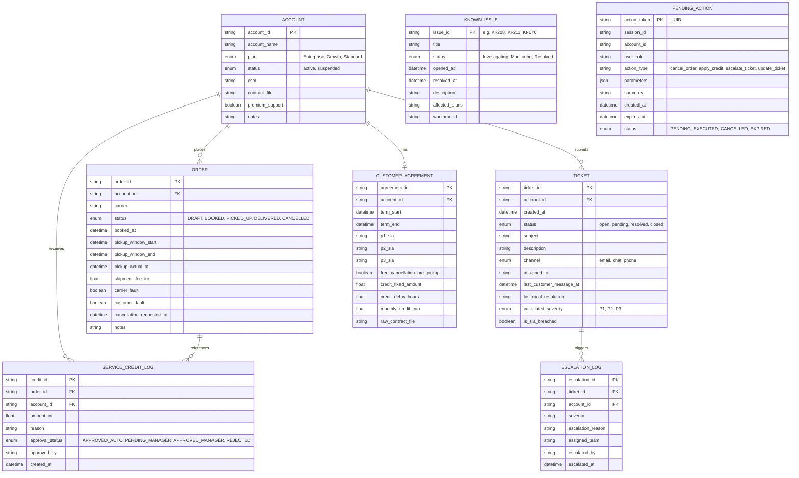

# ParcelPilot AI — Canonical Domain Model (Agent 02)

## 1. Domain Entity Relationship Diagram

---

## 2. Storage Partitioning Strategy

### 2.1 Structured Relational Storage (SQLite + SQLAlchemy)
- **Tables**: `accounts`, `orders`, `tickets`, `customer_agreements`, `service_credit_logs`, `escalation_logs`, `known_issues`, `pending_actions`.
- **Purpose**: ACID transactional integrity, multi-tenant relational filtering, deterministic arithmetic, exact equality/date range indexing, and strict state persistence.

### 2.2 Vector Storage (ChromaDB / Embedding Store)
- **Collection**: `parcelpilot_knowledge_base`
- **Indexed Sources**:
  - `01_Support_Policy_v3_CURRENT.pdf` (Global chunks)
  - `03_Cancellation_and_Service_Credit_SOP_v4.pdf` (Global chunks)
  - `04_Product_Operations_Guide_and_Known_Issues.pdf` (Global chunks)
  - `05_Northstar_Logistics_Enterprise_Agreement.pdf` (Tenant-scoped to `ACCT-001`)
  - `06_LumenWorks_Service_Agreement.pdf` (Tenant-scoped to `ACCT-002`)
- **Metadata Filters**:
  - `doc_id`: unique document identifier
  - `account_scope`: `GLOBAL` or specific `account_id`
  - `doc_status`: `CURRENT` (filter out `DEPRECATED`)
  - `authority_weight`: Integer rank (100 = Contract, 80 = SOP, 70 = Support Policy, 60 = Operations Guide)
- **Strict Exclusion**: Historical ticket resolution notes are excluded from vector embedding to avoid hallucination contamination.
