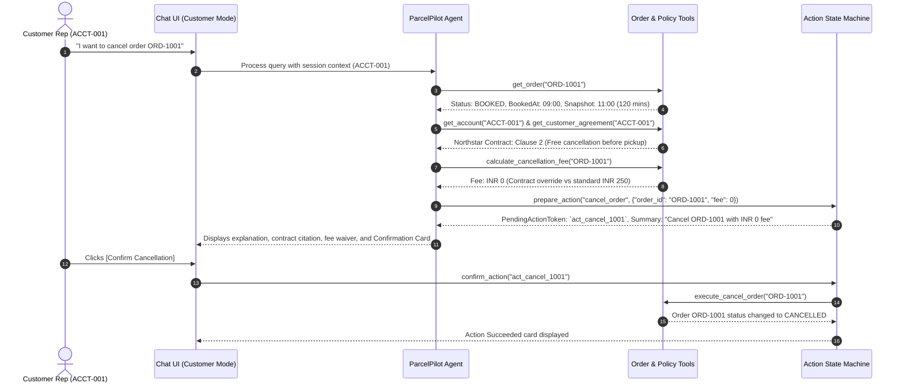
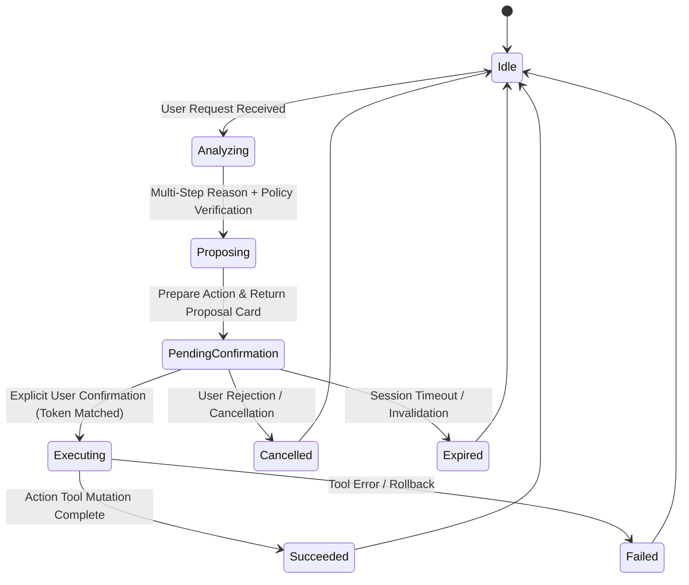

# ParcelPilot AI — User Flows & Interaction Workflows (Agent 01)

## 1. User Personas

| Persona | Role Identifier | Scope & Privileges | Example Context |
| :--- | :--- | :--- | :--- |
| **Customer Rep** | `customer` | Tenant-scoped read (own account only); Propose order cancellation; View public policies and own contract. | Representative at Northstar Logistics (`ACCT-001`) or LumenWorks (`ACCT-002`) |
| **Support Agent** | `support_agent` | Global read across all accounts; Triage tickets; Propose service credits (<= INR 1,000); Propose ticket status updates; View internal known issues. | Maya / Rohit on the ParcelPilot Tier 1/2 Support Desk |
| **Ops Manager** | `ops_manager` | Full global read/write; Approve service credits > INR 1,000; Escalate P1/P2 SLA breaches; Manage carrier dispute workflows. | Operations Director / Support Lead |

---

## 2. Customer Workflows

### Workflow C1: Customer Order Cancellation Request


### Workflow C2: Customer Post-Pickup Cancellation (Rejection / Safe Handling)
- **Scenario**: Customer at Northstar asks to cancel `ORD-1002` (which was picked up at 09:35).
- **Execution**:
  1. Agent checks order status via `get_order("ORD-1002")` -> Status is `PICKED_UP`.
  2. Agent checks SOP v4 Section 1 & Northstar Contract Section 2: "Once a shipment is PICKED_UP, the standard return-to-origin process applies. Do not cancel."
  3. Agent immediately refuses the cancellation action, explains that the shipment is already in transit with BlueDart Pro, and guides the customer on the Return-to-Origin (RTO) workflow.

---

## 3. Internal Support & Operations Workflows

### Workflow I1: SLA Triage & Critical Outage Escalation (TKT-501)
```mermaid
sequenceDiagram
    autonumber
    actor Support as Support Agent (Internal)
    participant UI as Chat UI (Internal Mode)
    participant Agent as ParcelPilot Agent
    participant Tool as Ticket & Contract Tools
    participant State as Action State Machine

    Support->>UI: "What is the status and priority of TKT-501?"
    UI->>Agent: Process query (Internal Role)
    Agent->>Tool: get_ticket("TKT-501")
    Tool-->>Agent: Ticket: Northstar, Subject: "All shipment creation is failing", Created: 10:30, Snapshot: 11:00
    Agent->>Tool: get_customer_agreement("ACCT-001")
    Tool-->>Agent: Northstar SLA: P1 target is 15 minutes, 24x7
    Agent->>Tool: evaluate_sla_status("TKT-501")
    Tool-->>Agent: Severity: P1 (Complete outage), Elapsed: 30m, Target: 15m, Status: BREACHED by 15m
    Agent-->>UI: Reports P1 Severity, 15m SLA breach, and proposes immediate Escalation
    Support->>UI: "Escalate this ticket to the On-Call Engineering team"
    Agent->>State: prepare_action("create_escalation", {"ticket_id": "TKT-501", "severity": "P1", "assigned_team": "On-Call Engineering"})
    State-->>Agent: PendingActionToken: `act_esc_501`
    Agent-->>UI: Renders Confirmation Card with breach details
    Support->>UI: Clicks [Confirm Escalation]
    UI->>State: confirm_action("act_esc_501")
    State-->>UI: Escalation created; Incident alert dispatched
```

### Workflow I2: Proactive Known Issue Diagnosis (TKT-502 & TKT-504)
- **Case 1 (TKT-502 - LumenWorks Bulk Upload Failure)**:
  - Input: LumenWorks reports 4,200 row CSV failure at 70%.
  - Agent queries active known issues: finds `KI-208` (Bulk upload failure > 3,000 rows on Growth/Enterprise).
  - Agent detects that historical ticket `TKT-451` had an incorrect agent resolution ("Growth only supports 3,000 rows").
  - Agent rejects historical ticket statement, cites authoritative Product Operations Guide (limit is 5,000 rows, but KI-208 is active defect), and provides verified workaround: "Split file into batches under 3,000 rows while engineering investigates."
- **Case 2 (TKT-504 - SwiftShip Delayed Webhook)**:
  - Input: Northstar reports driver picked up parcel 10m ago but still shows BOOKED.
  - Agent matches with `KI-211` (SwiftShip webhook delay up to 20 mins).
  - Agent informs agent/customer that parcel is likely safely picked up and advises waiting out the 20-minute window before initiating a carrier dispute.

### Workflow I3: Failed-Pickup Service Credit Calculation & Execution (ORD-2002)
- **Scenario**: LumenWorks reports `ORD-2002` missed pickup. Booked at 04:30, pickup window ended 06:30. Carrier RoadRunner accepted fault.
- **Reasoning**:
  1. Elapsed delay: 11:00 - 06:30 = 4.5 hours delay (> 4 hours).
  2. Carrier fault: True; Customer fault: False.
  3. Precedence Check: Default SOP v4 gives `min(500, 10% of 2400) = INR 240`. However, LumenWorks Service Agreement Clause 3 explicitly replaces SOP with a **fixed INR 300** credit for delays > 4 hours.
  4. Approval check: INR 300 <= INR 1,000 -> Does NOT require manager approval.
  5. Action: Agent proposes `apply_service_credit(order_id="ORD-2002", amount_inr=300, reason="Missed pickup > 4h carrier fault under LumenWorks Agreement Clause 3")`.
  6. Support Agent reviews and confirms.

---

## 4. State-Changing Action Life Cycle


